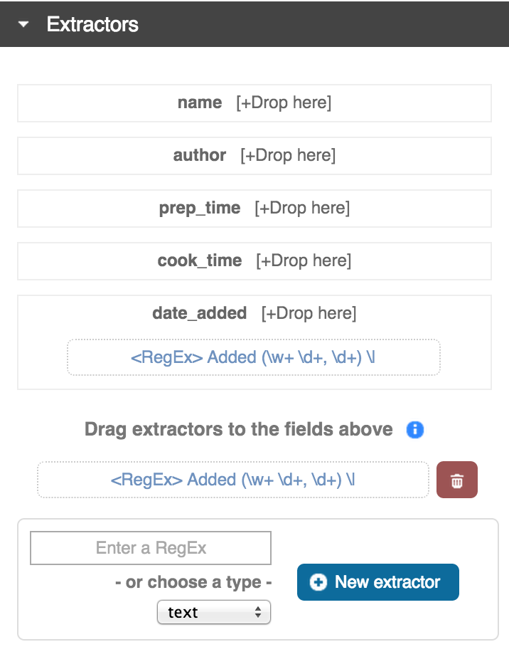
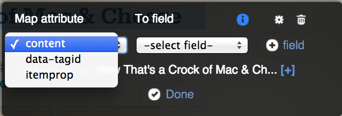
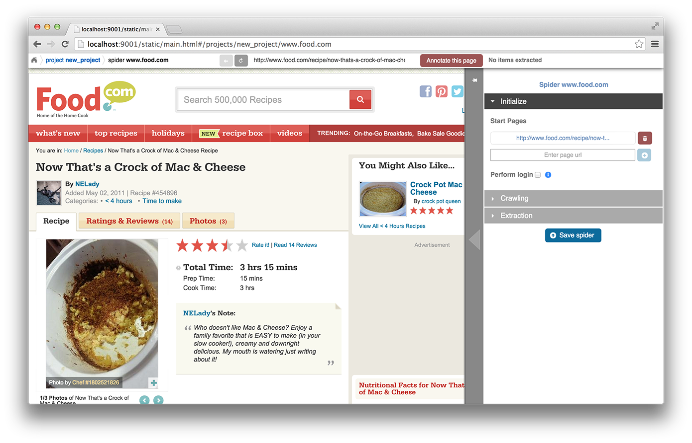
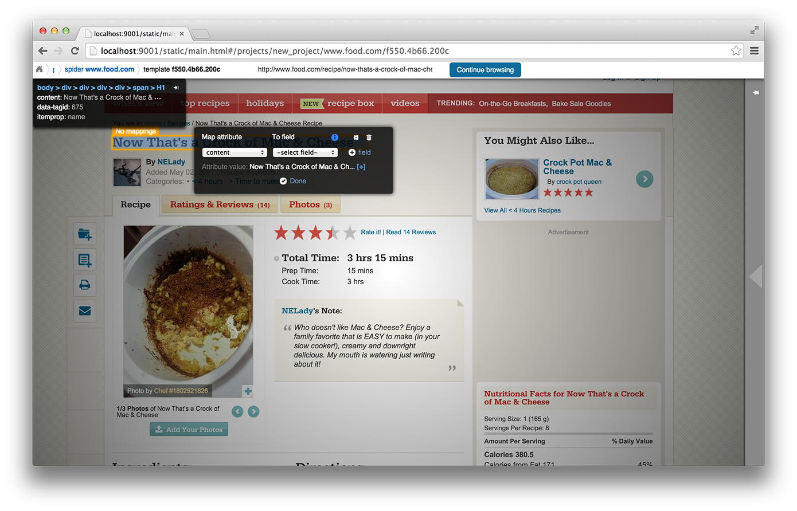
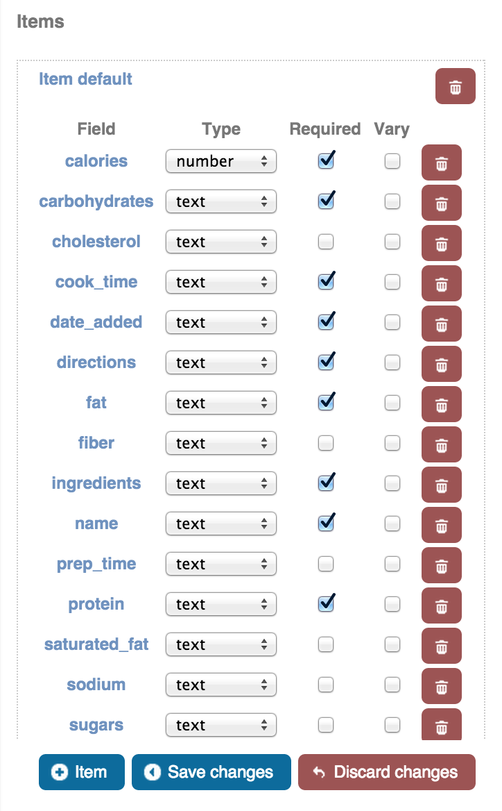
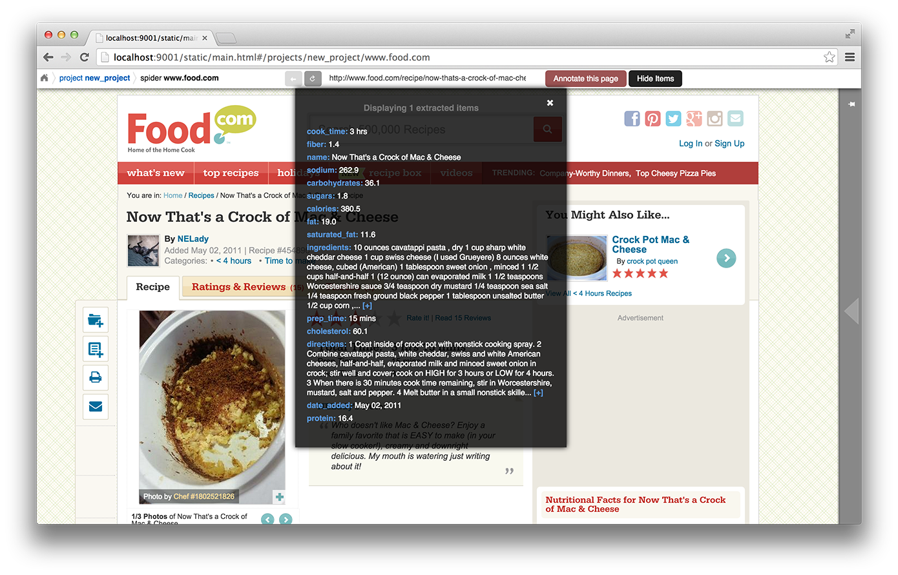

Portia
======

Portia is a tool that allows you to visually scrape websites without any programming knowledge required. With Portia you can annotate a web page to identify the data you wish to extract, and Portia will understand based on these annotations how to scrape data from similar pages. 

Anatomy of a Portia Project
---------------------------

A project in Portia generally consists of one or more spiders.

### Spider

A spider is a crawler for a particular website. The configuration of a spider is split into three sections: 
   
* **Initialization**
* **Crawling**
* **Extraction**

The **Initialization** section is used to set up the spider when it's first launched. Here you can define the start URLs and login credentials.

The **Crawling** section is used to configure how the spider will behave when it encounters URLs. You can choose how links are followed and whether to respect [nofollow](http://en.wikipedia.org/wiki/nofollow). You can visualise the effects of the crawling rules using the **Overlay blocked links** option; this will highlight links that will be followed in green, and links that won't be followed in red.

The **Extraction** section lists the templates for this spider.

### Templates

When the crawler visits a page, the page is matched against each template and templates with more annotations take precedence over those with less. If the page matches a template, data will be extracted using the template's annotations to yield an item (assuming all required fields are filled). Templates exist within the context of a spider and are made up of annotations which define the elements you wish to extract from a page. Within the template you define the item you want to extract as well as mark any fields that are required for that item. 

You can also add extractors to item fields. Extractors allow you to further refine information extracted from a page using either regexes or a predefined type. For example, let's say there's an element on the page that contains a phone number, but it also contains some other text that you don't need. You could use a regular expression that matches phone numbers and add it as an extractor to the relevant field; upon extracting that field only the phone number would be stored. 

You may need to use more than one template even if you're only extracting a single item type. For example, an e-commerce site may have a different layout for books than it does for audio CDs, so you would need to create a template for each layout. See [Tips for Working with Multiple Templates](#tips-for-working-with-multiple-templates) for more info.

### Annotations

An annotation defines the location of a piece of data on the web page and how it should be used by the spider. Typically an annotation maps some element on the page to a particular field of an item, but there is also the option to mark the data as being required without storing the data in an item. It's possible to map attributes of a particular element instead of the content if this is required, for example you can map the ``href`` attribute of an anchor link rather than the text.

### Items

An item refers to a single item of data scraped from the target website. A common example of an item would be a product for sale on an e-commerce website. It's important to differentiate **item** and **item definition**; in Portia an item definition or item type refers to the schema of an item rather than the item itself. For example, ``book`` would be an item definition, and a specific book scraped from the website would be an item. An item definition consists of multiple fields, so using the example of a product you might have fields named ``name``, ``price``, ``manufacturer`` and so on. Annotations are used to extract data from the page into each of these fields.

If you want to ensure that certain fields are extracted for an item, you can set the **Required** flag on a field which will discard an item if the field is missing. Duplicate items are removed by default. In some cases you may have fields where the value can vary despite being the same item, in which case you can mark them as **Vary** which will ignore the field when checking for duplicates. It’s important to only use **Vary** when necessary, as misuse could easily lead to duplicate items being stored. The ``url`` field is a good example of where **Vary** is useful, as the same item may have multiple URLs. If the ``url`` field wasn’t marked as **Vary** each duplicate item would be seen as unique because its URL would be different.

Creating a Portia Project
-------------------------

To create a new project, begin by entering the site's URL in the navigation bar at the top of the page and clicking ``Start``. Portia can be used as a web browser, and you can navigate to pages you want to extract data from and create templates for them. Clicking ``Start`` should create a new project along with a spider for the website, and you should see the loaded web page:

The spider can be configured on the right. The start pages are the URLs the spider will visit when beginning a new crawl. Portia can be used as a web browser, and you can navigate to the pages you want to extract data from and create new templates. To define the data you wish to extract from the page, click the ``Annotate this page`` button, which will create a new template and allow you to annotate the page.

You will now be able to define annotations by highlighting or clicking elements on the page. When annotating, a context menu will appear allowing you to map an element's attribute or content to a particular item field. Should you want to add a new item field without having to go into the item editor, you can use the ``-create new-`` option in the field drop down to create a new field. If you want to mark an element as having to exist on the page without storing its data, you can select ``-just required-`` instead of a field. It's important to note when using ``-just required-``, only the existence of the element will be checked rather than its content.

Once you are finished annotating, you can then mark any fields that are required by going into the item editor under ``Extracted item``. As mentioned earlier, if the item appears in several locations and some fields differ despite being the same item, you can also tick ``Vary`` on any relevant fields to exclude them from being used to detect duplicate items.

You can now confirm that your template works by clicking ``Continue browsing``. The page should reload and a pop-up should appear showing you the items extracted from the page. When visiting a page in Portia, the whole extraction process is performed with the spider with the set of currently defined templates. This allows you to check that data will be extracted from the page before running the spider against the whole website. 

If you have created a template around one page where the data extracts successfully, but you visit a similar page and no item is extracted, then it's likely that particular page has a different layout or some fields missing. In this case you would simply click ``Annotate this page`` again to create a new template for the page, and then annotate it the same way you had done with the other page. See [Tips for Working with Multiple Templates](#tips-for-working-with-multiple-templates) for more details on how multiple templates are used within a single spider.

Once you've confirmed that your spider works and extracts data properly, your project is now ready to [run](#running-portia) or [deploy](#deploying-a-project). 

Advanced Use of Annotations
---------------------------

### Multiple Fields

It's possible to extract multiple fields using a single annotation if there are several properties you want to extract from an element. For example, if there was an anchor link on the page, you could map the ``href`` attribute containing the URL to one field, and you could map the text to another. You can view a particular annotation's settings by either clicking the cog in the annotation pop-up window or by clicking the cog beside the annotation in the ``Annotations`` section of the template configuration. Within this context there is an ``Attribute mappings`` section where you can define additional mappings for the selected annotation should you want to map other attributes.

### Variants

It’s common for there to be a single item with a number of variations e.g. different sizes such as small, medium and large. It’s likely that each variation will have its own annotation for one or more fields and you want to keep each variation’s value. In situations like this you can use variants to make sure each value is stored. Each annotation you define has a variant selected, the default being ``Base`` referring to the base item. To assign an annotation to a variant, you simply select the variant you want the annotation to use in its options or under the ``Annotations`` section in the template settings.

Consider the following scenario where variants would be useful:

You are wanting to scrape an e-commerce website that sells beds, and some beds come in multiple sizes e.g. ``Single``, ``Double``, ``Queen``, ``King``. The product page for each bed has a table of prices for each size, like so:

<table>
    <tbody>
        <tr>
            <td>Single</td>
            <td>$300</td>
        </tr>
        <tr>
            <td>Double</td>
            <td>$500</td>
        </tr>
        <tr>
            <td>Queen</td>
            <td>$650</td>
        </tr>
        <tr>
            <td>King</td>
            <td>$800</td>
        </tr>
    </tbody>
</table>

The rest of the data you want to extract (product name, description etc.) is common across all sizes. In this case, you would annotate the common data to the base item and create the fields ``size`` and ``price``. You would then annotate the ``Single`` cell as variant 1 of ``size``, and the ``$300`` cell as variant 1 of ``price``, followed by annotating ``Double`` as variant 2 of ``size``, ``$500`` as variant 2 of ``price`` and so on. It's worth noting that in this case, it wouldn't be necessary to create a variant for each row; usually it is enough to annotate only the first and last row of the table as Portia will automatically create variants for rows in between.

### Partial Annotations

Partial annotations can be used to extract some part of text which exists as part of a common pattern. For example, if an element contained the text ``Price: $5.00``, you could highlight the ``5.00`` part and map it to a field. The ``Price: $`` part would be matched but removed before extracting the field. In order to create a partial annotation, all you need to do is highlight the text the way you would normally, by clicking and dragging the mouse. The annotation window will pop up and you will be able to map it to a field the same way you would with a normal annotation.

There are some limitations to partial annotations. As mentioned in the previous paragraph, the text must be part of a pattern. For example, let's say an element contains the following text:

    Veris in temporibus sub Aprilis idibus habuit concilium Romarici montium

One of the pages visited by the crawler contains the following text in the same element:

    Cui dono lepidum novum libellum arido modo pumice expolitum?

If you had annotated ``Aprilis`` in the template, nothing would have matched because the surrounding text differs from the content being matched against. However, if the following text had instead appeared in the same element:

    Veris in temporibus sub Januarii idibus habuit concilium Romarici montium

The word ``Januarii`` would have been extracted, because its surrounding text matches the text surrounding the text that was annotated in the template.

Tips for Working with Multiple Templates
----------------------------------------

It's often necessary to use multiple templates within one spider, even if you're only extracting one item type. Some pages containing the same item type may have a different layout or fields missing, and you will need to accommodate those pages by creating a template for each layout variation.

The more annotations a template has, the more specific the data being extracted and therefore less chance of a false positive. For this reason, templates with more annotations take precedence over those with less annotations. If a subset of templates contains equal number of annotations per template, then within that subset templates will be tried in the order they were created from first to last. In other words, templates are tried sequentially in order of number of annotations first, and age second.

If you are working with a large number of templates, it may be difficult to ensure the correct template is applied to the right page. It's best to keep templates as strict as possible to avoid any false matches. It's useful to take advantage of the ``-just required-`` option and annotate elements that will always appear on matching pages to reduce the number of false positives.

Consider the following example:

We have an item type with the fields ``name``, ``price``, ``description`` and ``manufacturer``, where ``name`` and ``price`` are required fields. We have create a template with annotations for each of those fields. Upon running the spider, many items are correctly scraped; however, there are a large number of items where the manufacturer field contains the description, and the description field is empty. This has been caused by some pages having a different layout:

Layout A:

<table>
    <tbody>
        <tr>
            <td>name</td>
            <td>price</td>
        </tr>
        <tr>
            <td colspan="2">manufacturer</td>
        <tr>
        <tr>
            <td colspan="2">description</td>
        </tr>
    </tbody>
</table>

Layout B:

<table>
    <tbody>
        <tr>
            <td>name</td>
            <td>price</td>
        </tr>
        <tr>
            <td colspan="2">description</td>
        </tr>
    </tbody>
</table>

As you can see, the problem lies with the fact that in layout B the description is where manufacturer would be, and with ``description`` not being a required field it means that the template created for layout A will match layout B. Creating a new template for layout B won't be enough to fix the problem, as layout A's template would contain more annotation and be matched against first. 

Instead we need to modify layout A's template, and mark the ``description`` annotation as **Required**. With this added constraint, items displayed with layout B will not be matched against with layout A's template due to the missing ``description`` field, so the spider will proceed onto layout B's template which will extract the data successfully.

Running Portia
--------------

### Installation

Checkout the repository:

    git clone https://github.com/scrapinghub/portia

Ideally, you should create an environment with virtualenv:

    virtualenv YOUR_ENV_NAME --no-site-packages
    source YOUR_ENV_NAME/bin/activate

Install the required packages:

    cd slyd
    pip install -r requirements.txt

### Running Portia

Start slyd:

    cd slyd
    twistd -n slyd

Portia will now be running on port 9001 and you can access it at: ``http://localhost:9001/static/main.html``

### Running Portia with Vagrant

You will need both [Vagrant](http://www.vagrantup.com/downloads.html) and [VirtualBox](https://www.virtualbox.org/wiki/Downloads) installed.

Run the following in Portia's directory:

    vagrant up

This will launch a Ubuntu virtual machine, build Portia and start the ``slyd`` server. You'll then be able to access Portia at ``http://localhost:8000/static/main.html``. You can stop the ``slyd`` server using ``vagrant suspend`` or ``vagrant halt``. To run ``portiacrawl`` you will need to SSH into the virtual machine by running ``vagrant ssh``.

### Running a Portia Spider

Projects you have created in Portia will reside in ``slyd/data/projects``. You can use ``portiacrawl`` to run a spider from one of your projects:

    portiacrawl PROJECT_PATH SPIDER_NAME

where ``PROJECT_PATH`` is the path of the project and ``SPIDER_NAME`` is a spider that exists within that project. You can list the spiders for a project with the following:

    portiacrawl PROJECT_PATH

Portia spiders are ultimately [Scrapy](http://scrapy.org/) spiders. You can pass Scrapy arguments when running with ``portiacrawl`` using the ``-a`` option. You can also specify a custom settings module using the ``--settings`` option. The [Scrapy documentation](http://doc.scrapy.org/en/latest) contains full details on available options and settings.

Deploying a Project
-------------------

Portia projects can be deployed using [Scrapyd](http://scrapyd.readthedocs.org/en/latest). You can deploy a Portia project by going into ``slyd/data/projects/PROJECT_NAME`` and adding your target to ``scrapy.cfg``. You can then run ``scrapyd-deploy`` to deploy your project using the default deploy target, or specify a target and project using the following:  

    scrapyd-deploy your_scrapyd_target -p project_name

and then schedule your spider with:

    curl http://your_scrapyd_host:6800/schedule.json -d project=your_project_name -d spider=your_spider_name
