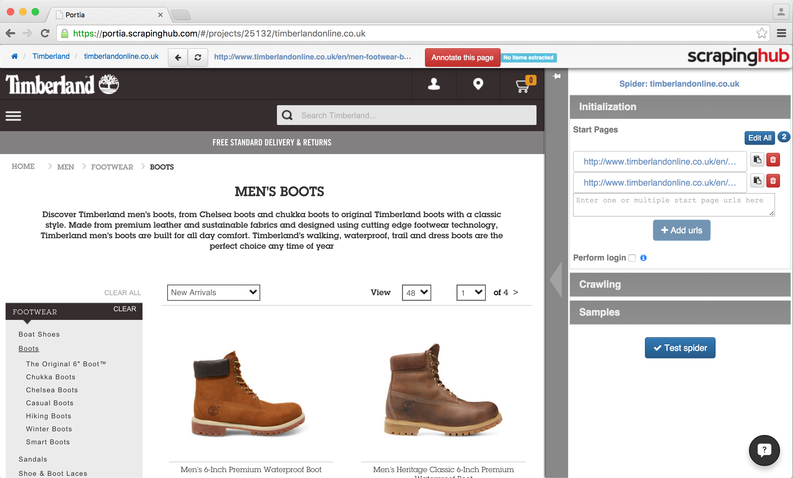
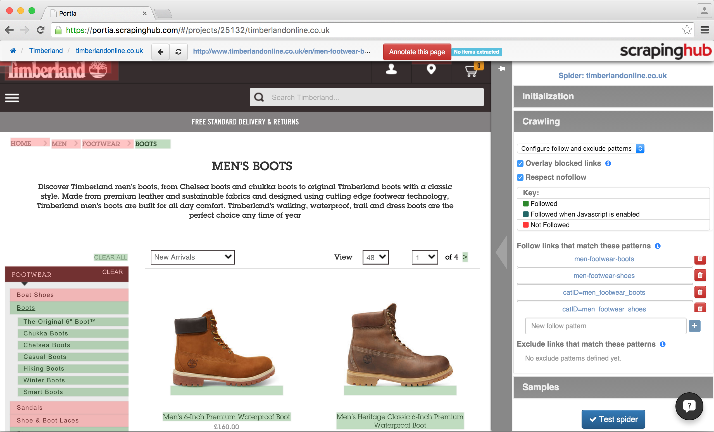
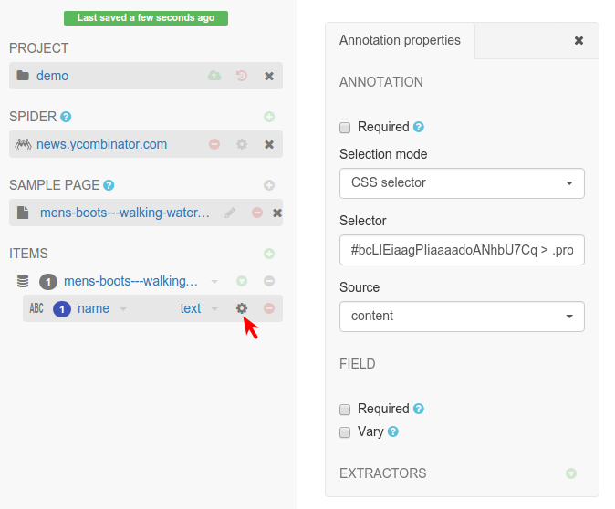
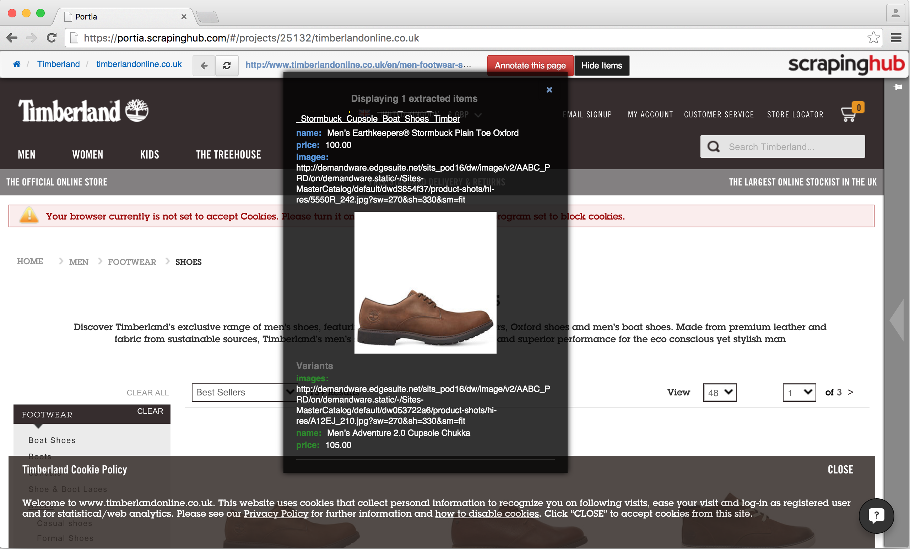

.. _examples:

========
Examples
========

Crawling paginated listings
===========================

Most e-commerce sites use pagination to spread results across multiple pages.

When crawling these sites with Portia, there are some best practices you should follow:

	* Use the target categories as start pages.
	* Use URL follow patterns to limit Portia to only visit category and article pages.

This will prevent Portia from visiting unnecessary pages so you can crawl the items a lot faster.

Let's use `timberlandonline.co.uk <http://www.timberlandonline.co.uk>`_ as an example. Say you want to only scrape products from the `boots <http://www.timberlandonline.co.uk/en/men-footwear-boots>`_ and `shoes <http://www.timberlandonline.co.uk/en/men-footwear-shoes>`_ categories. You can `create a spider <getting-started>`_ and add the categories to its start URLs:

To ensure the spider only visits relevant pages, you'll need to limit crawling to the target categories and product pages. You can accomplish this defining URL follow patterns in the Link Crawling configuration of your spider:

You can use follow patterns to filter URLs with `regular expressions <https://en.wikipedia.org/Regular_expressions>`_. You can see which links will be followed by clicking the |icon-toggle-links| button (toggle highlighting) to the right of Portia's URL bar. Followed links will be highlighted in green and excluded links in red.

As you can see above, the spider will now only visit the boots and shoes category pages and their product listings. To ensure that only products belonging to the target categories are visited, we filter against the ``catID`` parameter value in the URL.

Crawling listings in this manner is much more efficient. You avoid visiting tons of unwanted pages on the site and instead crawl only those you need.

Selecting elements with CSS and XPath
=====================================

You can select elements with CSS or XPath by changing the selection mode of an annotation. You can do it clicking the |cog-symbol| symbol right to the annotation name in the ``ITEMS`` section of the left sidebar.

This way, you can tweak your selections, making them more or less specific, for example.

.. |cog-symbol| unicode:: 0x2699

Extracting a single attribute to multiple fields
================================================

Portia supports multiple annotations for the same attribute. You can take advantage of this to extract an attribute to multiple fields by simply creating an annotation for each field.

Imagine you want to extract the username and the date from blog posts and this information is represented like this:

.. code-block:: html

    

        By johndoe on March 3th
    

To extract this information separately, you have to annotate the element, click the gear icon right after the field name and add an extractor with a regular expression that captures only the username: ``By (\w+).*``.

After that, you have to go back to annotation mode, click the |icon-add| button in the toolbar and then annotate the same element again. Now, you have to create another extractor to capture only the date from the element: ``By \w+ on (.*)``.

.. |icon-add| image:: _static/portia-icon-add.png
    :width: 16px
    :height: 16px

Scraping multiple items from a single page
==========================================

You'll often need to retrieve several items from a single page. You can do this using either the repeating element tool |portia-icon-add-repeat| or with the wand |portia-icon-wand| by annotating the first item's element and then clicking the second item's element. Portia will detect all similar items on the page and create annotations for each of them.

.. |portia-icon-add-repeat| image:: _static/portia-icon-add-repeat.png
    :width: 16px
    :height: 16px

.. |portia-icon-wand| image:: _static/portia-icon-wand.png
    :width: 16px
    :height: 16px

Let's revisit the `timerberlandonline.co.uk <http://www.timberlandonline.co.uk>`_ spider and demonstrate this process by annotating a couple of pairs of shoes.

Click the tiles icon to select the repeating element tool and then click an element, and Portia will find all similar elements and link them to the same field:

Now you just need to do same for the other fields, and you're done!

.. _multiple-samples-example:

Using Multiple Samples to Deal with Different Layouts
=====================================================

Some websites use different layouts to display the same kind of information. E-commerce websites usually create special pages for some products on Black Friday, for example. Sometimes, the problem is that some pages might not have all the data you need.

You can create multiple samples, even if you are extracting only one item type, to make sure your spider can handle these variations.

**Consider this example:** our spider has an item type with the fields ``name``, ``price``, ``description`` and ``manufacturer``, where ``name`` and ``price`` are required fields. We have created a sample with annotations for each of those fields. Upon running the spider, many items are correctly scraped; however, there are a large number of scraped items where the ``manufacturer`` field contains what should be the ``description``, and the ``description`` field is empty. This has been caused by some pages having a different layout:

Layout A:

.. code-block:: html

    <table>
        <tbody>
            <tr>
                <td>name</td>
                <td>price</td>
            </tr>
            <tr>
                <td colspan="2">manufacturer</td>
            <tr>
            <tr>
                <td colspan="2">description</td>
            </tr>
        </tbody>
    </table>

Layout B:

.. code-block:: html

    <table>
        <tbody>
            <tr>
                <td>name</td>
                <td>price</td>
            </tr>
            <tr>
                <td colspan="2">description</td>
            </tr>
        </tbody>
    </table>

As you can see, the problem lies with the fact that in layout B the description is where manufacturer would be, and with ``description`` not being a required field it means that the sample created for layout A will match layout B. Creating a new sample for layout B won't be enough to fix the problem, as layout A's sample :ref:`would contain more annotation and be matched against first <multiple-samples>`.

Instead we need to modify layout A's sample, and mark the ``description`` annotation as **Required**. With this added constraint, items displayed with layout B will not be matched against layout A's sample due to the missing ``description`` field, so the spider will proceed onto layout B's sample which will extract the data successfully.

:ref:`Click here to learn more about Multiple Samples <multiple-samples>`.
