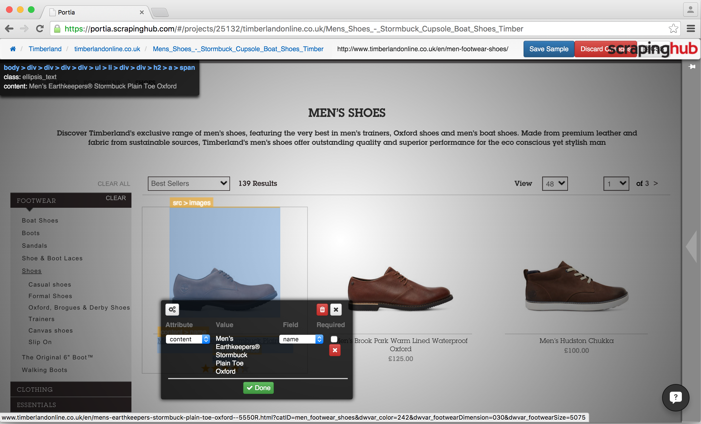
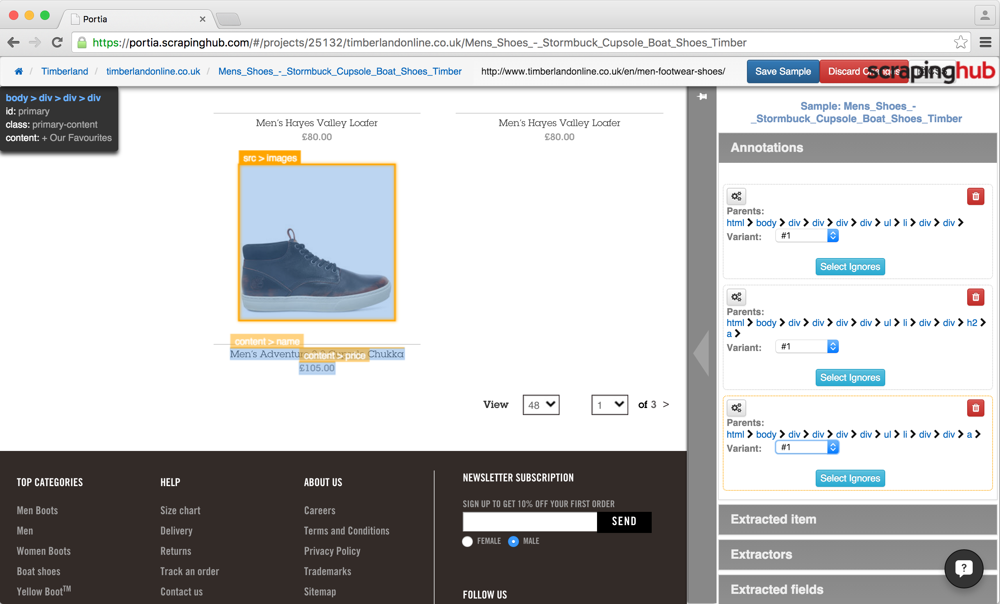

.. _examples:

========
Examples
========

Crawling paginated listings
===========================

Most e-commerce sites use pagination to spread results across multiple pages.

When crawling these sites with Portia, there are some best practices you should follow:

	* Use the target categories as the start URL.
	* Use follow patterns to limit Portia to only visit category and article pages.

This will prevent Portia from crawling visiting unnecessary pages so you can crawl the items a lot faster.

Let's use `timberlandonline.co.uk <http://www.timberlandonline.co.uk>`_ as an example. Say you want to only scrape products from the `boots <http://www.timberlandonline.co.uk/en/men-footwear-boots>`_ and `shoes <http://www.timberlandonline.co.uk/en/men-footwear-shoes>`_ categories. You can can `create a spider <getting-started>`_ and add the categories to its start URLs:

.. image:: _static/portia-start-urls.png
	:alt: Start URLs

To ensure the spider only visits relevant pages, you'll need to limit crawling to the target categories and product pages. You can accomplish this using follow patterns:

.. image:: _static/portia-follow-patterns.png
	:alt: Follow patterns

Follow patterns are used to filter URLs using `regular expressions <https://en.wikipedia.org/Regular_expressions>`_. By checking ``Overlay blocked links``, you can see which links on the page will be followed.

As you can see above, the spider will now only visit the boots and shoes category pages and their product listings. To ensure that only products belonging to the target categories are visited, we filter against the ``catID`` parameter value in the URL.

Crawling listings in this manner is much more efficient. You avoid visiting tons of unwanted pages on the site and instead crawl only those you need.

Scraping multiple items from a single page
==========================================

You'll often need to retrieve several items from a single page. You can do this using :ref:`samples-variants` with the following steps:

- Annotate the *first* item and map its fields to variant #1.
- Annotate the *last* item and map its fields to variant #2.
- Enable the *Split Variants* extension.

If the items are in a list (``<ul>`` or ``<ol>`` block), Portia will detect the items in between the first and last and create variants for each. Note that sometimes you will need to annotate each item and link to variants manually.

The *Split Variants* add on will create separate items for each variant during the crawl.

Revisiting the `timerberlandonline.co.uk <http://www.timberlandonline.co.uk>`_ spider, let's demonstrate this process by annotating shoes on the category page.

Start by annotating the first item and mapping its fields to the variant #1:

Then do the same with the last item, only this time mapping to variant #2:

Save the template, and the item preview will show the first and last item. During the crawl, all other items will be extracted.

.. image:: _static/portia-multi-preview.png
	:alt: Start URLs

To convert variants into separate items during the crawl, you'll need to use the split variants extension. You can find the extension in the ``scrapylib`` package, which you can install via pip::

	$ pip install scrapylib

Then simply enable it in your settings::

	EXTENSIONS = {
		'scrapylib.splitvariants.SplitVariantsMiddleware': True
	}
	SPLITVARIANTS_ENABLED = True

Now your spider will scrape every item from the page. If it doesn't, then you will need to annotate each item individually as mentioned before.
