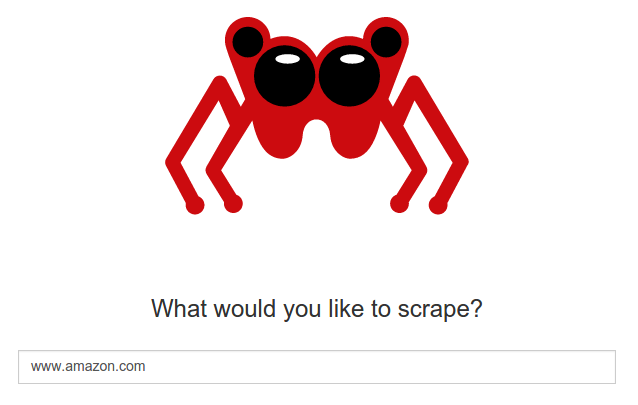

.. _getting-started:

===============
Getting Started
===============

.. note:: If you don't have Portia running yet, please read the :ref:`Installation guide <installation>` first. If you're using a hosted version of Portia on a platform like `Scrapinghub <http://scrapinghub.com>`_, you don't need to install anything.

This tutorial will briefly cover how to scrape amazon.com_ with Portia. Your goal here is to extract the name and the price from Amazon.com_ products.

.. _amazon.com: http://amazon.com/

First, you have to create a Portia project, open it and then provide the URL that you want to scrape.

After doing so, Portia will load the URL you asked into its browser and you should see a page like this:

.. image:: _static/portia-main-page.png
    :alt: Portia main page

Now, you have to **create a Spider**, clicking in the ``New spider`` button, and then you will see the page below:

.. image:: _static/portia-new-spider.png
    :alt: Newly created spider

You can configure the spider on the left sidebar. You may notice the URL you entered has been added as a **start page**. Start pages act as seeds for the crawl and the spider will visit these first.

Now that you've created your spider, you need to define the data you want to extract. You'll do this using :ref:`samples <samples>`.

Creating a Sample
=================

A **sample** is a template describing which data you want to extract from a page. This sample will be used by Portia to extract data from other pages who may have different contents but similar structure.

Portia acts like a web browser, so you can navigate between pages as you would normally. You have to navigate to a page you want to extract data from and click ``New sample`` to start creating a sample. (any product page works for this tutorial)

Now, you have to :ref:`annotate <what-are-annotations>` the page, by clicking in the elements you want to scrape and setting a proper field name and data type in the left sidebar. Portia will create an :ref:`item <items>` schema from the elements that you annotated and will use it as the data format for the scraped :ref:`items <items>`.

.. image:: _static/portia-annotation.png
    :alt: Annotating a page

You can see a preview with the items that Portia would collect from that page in the right sidebar, given the sample that you are creating.

Once you have selected all the elements that you want to scrape (in this case, title and price), you have to close the sample by clicking in ``Close sample``. 

The sample is everything that Portia needs in order to know which data you want to extract and how to extract them from the web pages.

Your spider is ready to run. But you might want to follow the next section to learn how to define which pages Portia will crawl.

Configuring the Crawling
========================
Portia crawls a website starting from the URLs defined on ``START PAGES``. You can easily add more start pages (also called as **seed URLs**) to your spider, if you need so:

.. image:: _static/portia-add-start-pages.png
    :alt: Adding start pages

By default, Portia follows all the in-domain URLs that it finds while crawling. However, sometimes you don't want it to follow every link. For example, some pages on amazon have a completely different structure (categories pages, help pages, etc), so they don't match the sample you just created.

In this case, you might want to change the default link crawling policy, setting Portia to follow only links from product pages (ie, pages whose URL contains ``/dp/``). To do so, you can change the crawling policy to ``Configure URL patterns`` and add ``/dp/`` as the URL pattern in the crawling rules:

.. image:: _static/portia-configuring-crawling.png
    :alt: Configuring the crawling

Next
====
Now that you created the sample and defined the crawling rules, it's time to :ref:`run <running-spider>` your spider.