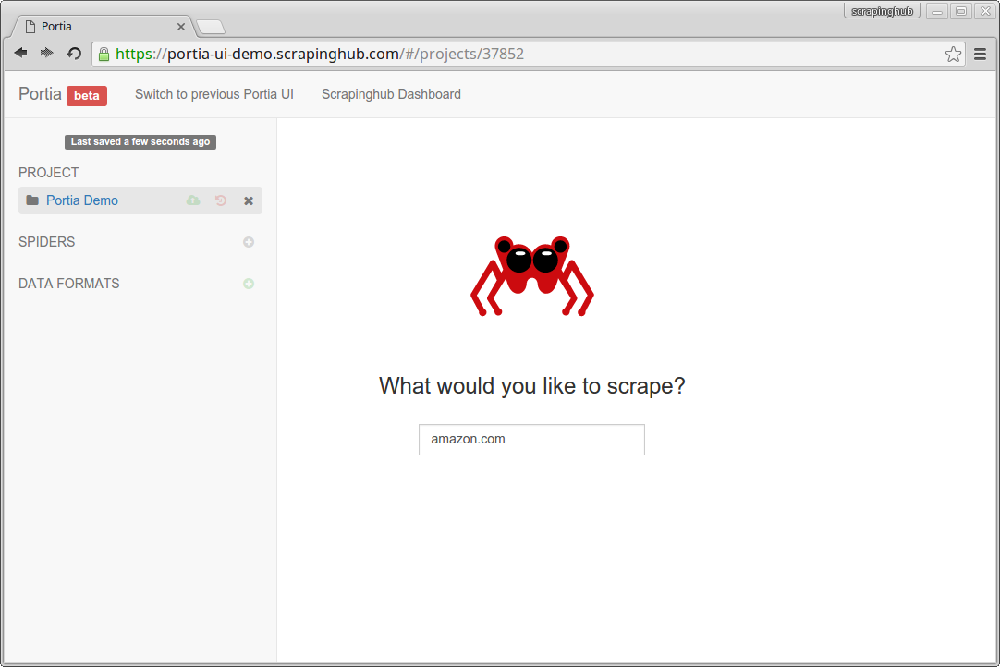
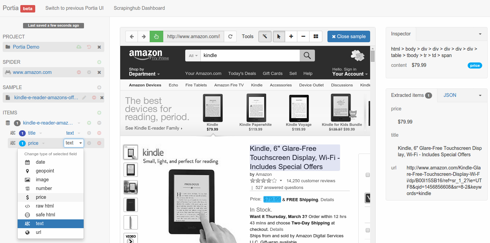
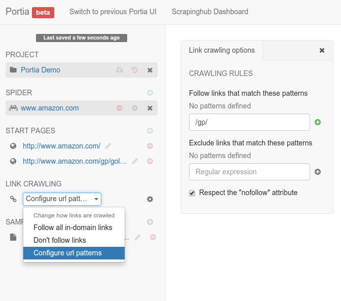

.. _getting-started:

===============
Getting Started
===============

.. note:: If you don't have Portia running yet, please read the :ref:`Installation guide <installation>` first. If you're using a hosted version of Portia on a platform like `Scrapinghub <http://scrapinghub.com>`_, you don't need to install anything.

This tutorial will briefly cover how to scrape amazon.com_ with Portia. Your goal here is to extract the name and the price from Amazon.com_ products.

.. _amazon.com: http://example.com/

Creating a Spider
=================
Go to Portia and feed it with the amazon.com_ URL:

You will see a page like this after doing so:

.. image:: _static/getting-started-2.png
    :alt: Portia internal browser

Now, click on the ``New spider`` button to start creating your Portia spider. In the next step you'll create a **sample** from a page.

Creating a Sample
=================
A sample is like a template describing which data you want to extract from a page. This sample will be used by Portia to extract data from pages who have different contents but similar structure.

To create a sample, you should navigate to a random product page and click on the ``New sample`` button. Once you are editing the sample, you just have to click in the elements that you want to scrape and give them a proper name and data type in the **left sidebar**.

As you can see, the **right sidebar** shows a preview of the items that Portia would collect from that page, given the sample that you are creating.

Once you selected all the elements that you want to scrape (in this case, title and price), you have to click the ``Close sample`` button.

Now, your spider is ready to run. But you might want to follow the next section to learn how define which pages Portia will crawl.

Configuring the Crawling
========================
Portia crawls a website starting from the URLs defined on ``START PAGES``. You can easily add more start pages (also called as **seed URLs**) to your spider, if you need so:

.. image:: _static/getting-started-4.png
    :alt: Adding start pages

By default, Portia follows all the in-domain URLs that it finds while crawling. However, sometimes you don't want it to follow every link. For example, some pages on amazon doesn't match the sample you just created (categories pages, help pages, etc).

In this case, you might want to change the default link crawling policy, setting Portia to follow only links from product pages (ie, pages whose URL contains ``/gp/``). To do so, you can change the crawling policy to ``Configure URL patterns`` and add ``/gp/`` as the URL pattern in the crawling rules:

Next
====
Now that you created the sample and defined the crawling rules, it's time to :ref:`run <running-spider>` your spider.