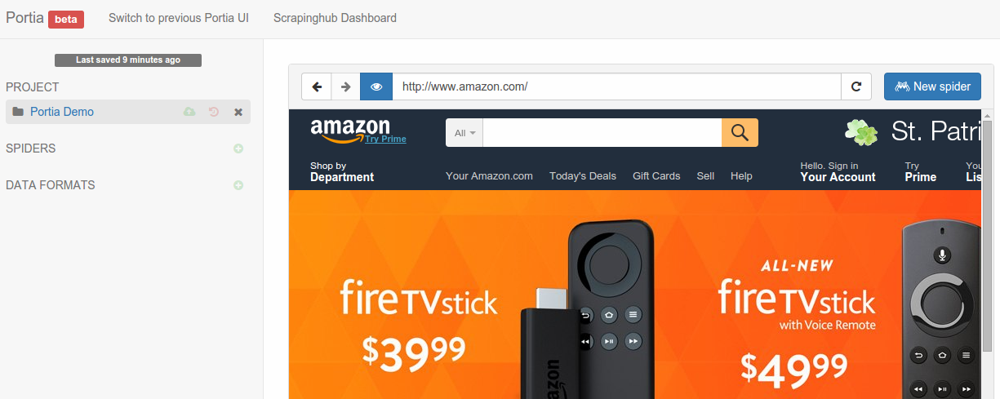
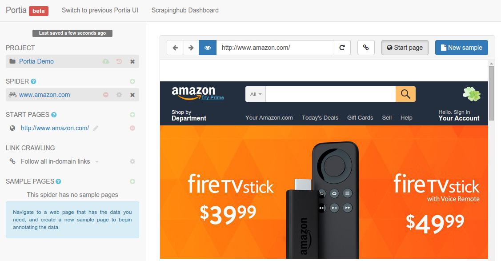
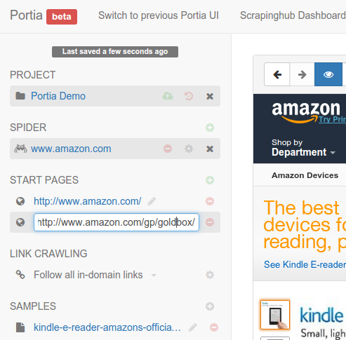
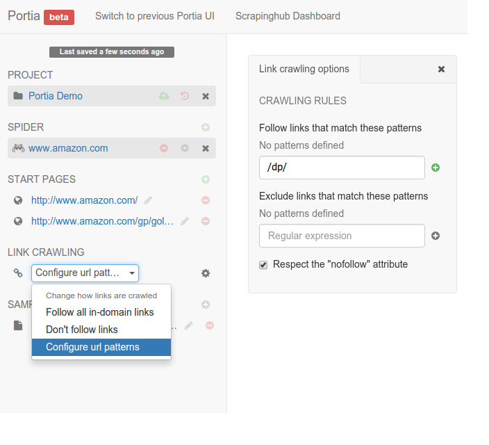

.. _getting-started:

===============
Getting Started
===============

.. note:: If you don't have Portia running yet, please read the :ref:`Installation guide <installation>` first. If you're using a hosted version of Portia on a platform like `Scrapinghub <http://scrapinghub.com>`_, you don't need to install anything.

This tutorial will briefly cover how to begin extracting data with Portia.

Creating a spider
=================

Let's start by creating a project. Enter a URL and Portia will render it like below:

.. This tutorial will briefly cover how to retrieve products from Amazon.com_ using Portia.

.. .. _amazon.com: http://amazon.com/

.. First, create a Portia project and enter a URL. Portia will render it like below:

Click the ``New spider`` button to create a new spider. Portia will add the page's URL as a start page automatically. Start pages are used to seed the crawl and Portia will visit them when you start the spider to find more links.

Creating a sample
=================

A sample describes how data should be extracted from the page. Portia will use your samples to extract data from other pages with a similar structure.

Portia works like a web browser, so you can navigate between pages as you would normally. Navigate to a page you want to scrape 	and then the ``New sample`` button to create a :ref:`sample <samples>` of the page.

Now that you've created the sample, you can begin :ref:`annotating <what-are-annotations>` the page. Annotations link a piece of data in the page to an item field. You'll notice that you can highlight elements on the page, if you click on it will create a new field to which the element will be extracted. 

Portia will create an :ref:`item <items>` schema from the elements that you annotated and will use it as the data format for the scraped :ref:`items <items>`.

.. image:: _static/portia-annotation.png
    :alt: Annotating a page

You can see a preview of the items your sample will extract on the right. Once you've annotated all the data you wish to extract, close the sample. Your spider is :ref:`ready to run <running-spider>`, but you may want to configure it further in which case you should continue reading.

Configuring your crawler
========================

To start crawling a website, Portia needs one or more URLs to visit first so it can gather further links to crawl. You can define these URLs on the left under ``START PAGES``.

Portia follows all in-domain URLs by default. In many cases you'll want to limit the pages Portia will visit so requests aren't wasted on irrelevant pages. 

To do this, you can set follow and exclude patterns that whitelist and blacklist URLs respectively. These can be configured by changing the crawling policy to ``Configure URL patterns``. 

For example, Amazon products' URLs contain ``/gp/``, so you can add this as a follow pattern and Portia will know to only follow such URLs.

What's next?
============

Once you've created your samples and configured crawling behavior, it's time to :ref:`run <running-spider>` your spider.

Check out the :ref:`examples` to learn a few tips to be more productive with Portia.
