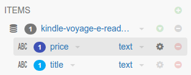
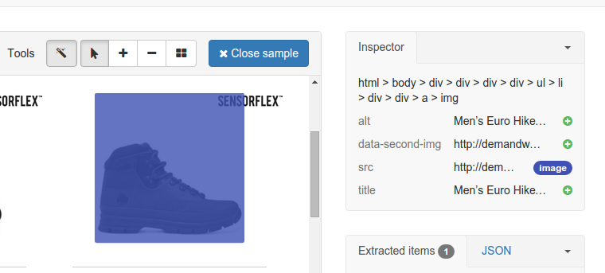

.. _samples:

=======
Samples
=======

What are samples?
=================

When the crawler visits a page, it matches the page against each sample. Samples with more annotations take precedence over those with less. If the page matches a sample, it will use the sample's annotations to extract data. Assuming all required fields are filled, it will yield an item. Spiders consist of one or more samples and each sample is made up of annotations that define the elements you wish to extract. Within the sample you define the item you want to extract and mark required fields for that item.

.. _what-are-annotations:

What are annotations?
=====================

An annotation defines the location of a piece of data on the web page and how it should be used by the spider. Typically an annotation maps some element on the page to a particular field of an item, but there is also the option to mark the data as being required without storing the data in an item. It's possible to map attributes of a particular element instead of the content if this is required, for example you can map the ``href`` attribute of an anchor link rather than the text.

Annotations
===========

Creating annotations
--------------------

You can create annotations by clicking an element on the page with the appropriate tool selected. You should use the wand (|icon-wand|) most of the time as it will select the appropriate tool automatically. The following tools are available:

* |icon-wand| - Select the most appropriate tool when clicking on an element
* |icon-select| - Select an element
* |icon-add| - Add an element
* |icon-sub| - Remove an element
* |icon-add-repeat| - Add repeating element

.. |icon-select| image:: _static/portia-icon-pointer.png
    :width: 16px
    :height: 16px

Extractors
----------

You can also add extractors to annotations. Extractors let you use regular expressions or a pre-defined type to further refine data extracted from a page.

For example, assume there's an element that contains a phone number, but it has additional text that you don't need. In this scenario you could add an extractor to retrieve only the phone number instead of the full text.

You can define the extractor for a particular field by clicking in the gear icon right after the field type:

And then you can select use any built-in extractors or create your own extractor via regular expressions:

.. image:: _static/portia-extractors.png
    :alt: Field extractors

Multiple fields
---------------

It's possible to extract multiple fields using a single annotation if there are several properties you want to extract from an element. For example, if there was an image you wanted, you could map the ``src`` attribute that contains the image URL to one field, and the ``alt`` attribute to another.

You can do it in the ``Inspector`` panel in the top left of the screen:

Just click the ``+`` button right after an attribute to add a new field based on the same annotation.

.. _multiple-samples:

Multiple samples
================

It's often necessary to use multiple samples within one spider, even if you're only extracting one item type. Some pages containing the same item type may have a different layout or fields missing, and you will need to accommodate for those pages by creating a sample for each variation in layout.

Sample precedence
-----------------

The more annotations a sample has, the more specific the data being extracted and therefore less chance of a false positive. For this reason, samples with more annotations take precedence over those with less annotations. If a subset of samples contains equal number of annotations per sample, then within that subset samples will be tried in the order they were created from first to last. In other words, samples are tried sequentially in order of number of annotations first, and age second.

If you are working with a large number of samples, it may be difficult to ensure the correct sample is applied to the right page. It's best to keep samples as strict as possible to avoid any false matches. It's useful to take advantage of the ``Required`` option from item fields and annotate elements that will always appear on matching pages to reduce the number of false positives.

**Check this example** to learn how to do it: :ref:`multiple-samples-example`.
